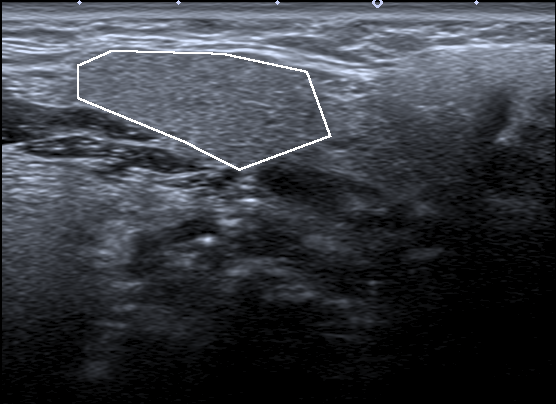
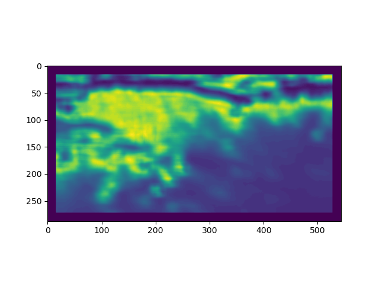
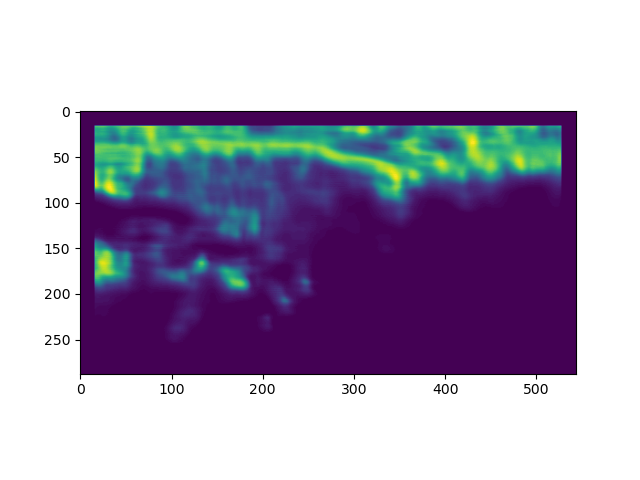
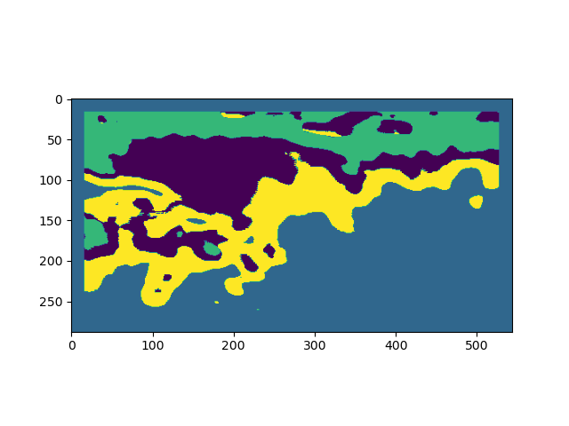

# parotide
This project present a method for segementation of images. in this repository we apply our method to 
biomedical image.

## Getting Started

These instructions will get you a copy of the project up and running on your local machine for development and testing purposes. See deployment for notes on how to deploy the project on a live system.

### Dependencies

* Python 3.6
* cv2 3.4.2
* Pytorch 1.3.1
* Skimage 0.16.2
* Numpy 1.19.1
* matplotlib 3.3.1

### Installing

Create conda virtual env with all package listed ahead
Clone the repo
Give us the data file
* data_base
* texture file, test_texture

### Run

Run the proces_image.py to create a database
Run the process_texture_test.py to grate the texture database
Run create_feature_map.py 
you canget for th next image

the feature 1 file will be like 

the feature 2 file will be like 

And clustering with KNN and 4 class


### And coding style tests

You can test independent the script by run
```
python3 script.py
```
And see the result

## Authors

* **Gabin Fodop** - *Initial work* - [teriterance](https://github.com/teriterance)

See also the list of [contributors](https://github.com/teriterance/parotide/contributors) who participated in this project.

## License

This project is licensed under the MIT License - see the [LICENSE.md](LICENSE.md) file for details

## Acknowledgments

this code is inspired by:
* texture segmentation using siamese network and hierarchical region merging, Ryusuke YamadaHidenori IdeHidenori IdeNovanto YudistiraNovanto YudistiraTakio KuritaTakio Kurita
* Region-Focus Training: Boosting Accuracy for Deep-Learning Image Segmentation, Chanok PathompataiRatchadaporn KanawongPinyo TaeprasartsitPinyo Taeprasartsit
* Siamese networks
* An Efficient Agglomerative Clustering Algorithm for Region Growing
* etc
